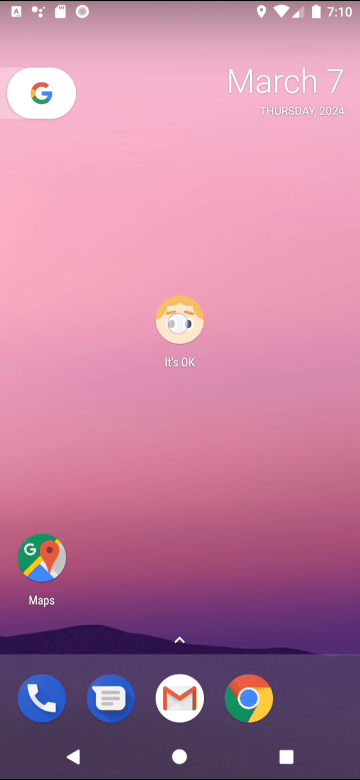
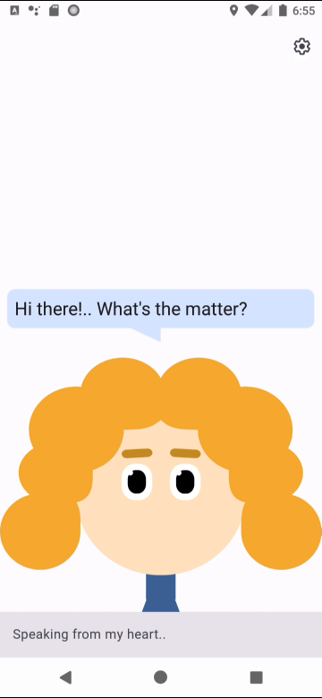

# It's OK!
## _Type instead of overthinking._

  

## Table of Contents

- [Description](#description)
- [System Requirements](#system-requirements)
- [Installation](#installation)
- [Instructions](#instructions)
- [Testing](#testing)
- [Dependencies](#dependencies)
- [Contributors](#contributors)

## Description
A tiny application focused on helping the user get rid of a disturbing gripe by typing it. As an alleviation, the user is provided with positive mementos. The last ones can be supplemented by the user itself. It's possible to provide a memento in the form of an image and/or a phrase. As a final piece, the whole process of gripe typing is implemented in the form of chatting with a cute animated avatar.

## System Requirements

Your device has to meet the following requirements:
- Android OS with API Level $\geq$ 21 (version 5.0 or higher);
- 1 GB of RAM;
- ~50 MB of free space.

## Installation

In order to get an app on your device, one needs to hit the following Google Play link: https://play.google.com/store/apps/details?id=com.qubacy.itsok

## Instructions

Once you feel a little overwhelmed with problems, you're ready to have a small talk with our cute avatar. She is ready to listen to you and give you a portion of motivation to move further towards your life goals.

It's necessary to provide your personal motivating mementos. You're welcome to do it in Settings:

## Testing

Almost all crucial components of the app have been covered with tests (Unit & Instrumentation). The coverage percentage was roughly 60-70% at the time.

## Dependencies

The following noticeable libraries & frameworks are in use in the app:
- [Navigation Framework](https://developer.android.com/guide/navigation) (for handling transitions between fragments & activities);
- [Dagger Hilt](https://dagger.dev/hilt/) (Dependency Injection framework);
- [Room](https://developer.android.com/jetpack/androidx/releases/room) (for building an Application - Database communication layer);
- [Mockito](https://github.com/mockito/mockito) (for mocking classes' objects in tests);
- [Espresso](https://developer.android.com/training/testing/espresso) (for Instrumentation Testing);
- [Turbine](https://github.com/cashapp/turbine) (for testing Kotlin Flows).

## Contributors

The application was fully made by Semyon Dzukaev in 2024. All rights reserved.